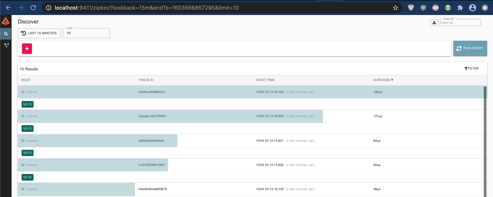

# Система оценки работодателей 
Проектная работа курса "Разработчик на Spring Framework" в OTUS

## Описание

Система позволяет пользователю по набору предварительно заданных критериев с весами проводить оценку потенциальных работодателей и получать список наиболее предпочтительных работодателей.

То есть в системе присутствуют пользователи, у каждого пользователя будет свой набор критериев для оценки работодателей и будет набор статистики по работодателям с визуализацией к примеру топ3 наиболее выгодных.

## Архитектура системы

## Работа с системой

### Предварительные требования

Необходимо иметь установленный Docker и docker-compose.

### Запуск системы

#### Запуск в Docker
Запуск осуществляется командой:

    docker-compose up -d
    
Первоначальный старт системы может длиться до часа, в зависимости от мощности компьютера.
Это связано с необходимостью подготовки образов Docker.

#### Запуск standalone
Система также может быть запущена по-модульно в следующей последовательности:

1) config-server
2) discovery-server
3) microservice-criteria, microservice-criteria, microservice-users
4) microservice-ui
5) hystrix-dashboard

Перед запуском необходимо поднять сервер PostgreSQL, желательно последней версии.

В таком варианте запуска не будут доступны Zipkin, Prometheus, Grafana. Предлагается их установить/запустить отдельно.

### Работа с системой

**Предупреждение**: в системе встроены меняющиеся задержки ответов от БД и микросервисов. Если получена ошибка при попытке логина или при работе с системой следует повторить попытку до получения ожидаемого результата. 

#### Основной микросервис для работы пользователей
доступен по адресу: [http://localhost:8080](http://localhost:8080])

Для логина в систему изначально встроены два пользователя:
* Администратор: admin/pass
* Пользователь: user/pass

Администратор может добавлять/редактировать/удалять пользователей.

После входа в систему пользователь может задавать критерии, работодателей и смотреть текущий рейтинг работодателей в соответствующих вкладках меню.

#### Discovery server Eureka
доступен по адресу: [http://localhost:8761](http://localhost:8761)

#### Hystrix dashboard
доступен по адресу: [http://localhost:8788/hystrix](http://localhost:8788/hystrix)

Для просмотра состояния доступности микросервисов необходимо для нужного микросервиса прописать параметры стрима, доступные в актуаторе для каждого микросервиса.
К примеру, для microservice-ui следует задать стрим:

* для варианта запуска через Docker: `http://localhost:8080/actuator/hystrix.stream` 
* для варианта запуска standalone: `http://ui:8080/actuator/hystrix.stream` 

Параметры 'Delay' и 'Title' можно задать любые.

В итоге будем иметь возможность отслеживать состояние по примерно такой ссылке: 

[http://localhost:8788/hystrix/monitor?stream=http%3A%2F%2Fui%3A8080%2Factuator%2Fhystrix.stream&delay=2000&title=UI](http://localhost:8788/hystrix/monitor?stream=http%3A%2F%2Fui%3A8080%2Factuator%2Fhystrix.stream&delay=2000&title=UI)

#### Трассировка при помощи Zipkin
доступна по адресу: [http://localhost:9411/zipkin](http://localhost:9411/zipkin)

#### Мониторинг

Сбор метрик Prometheus доступен по адресу: [http://localhost:9090](http://localhost:9090)

Контроль состояния работы микросервисов доступен в Grafana по адресу: [http://localhost:3000](http://localhost:3000)

Начальный доступ возможен со следующими реквизитами: admin/admin123

Для контроля рекомендуется использовать следующие dashboards:
* Spring Boot 2.1 Statistics, #10280, [https://grafana.com/grafana/dashboards/10280](https://grafana.com/grafana/dashboards/10280)
* JVM (Micrometer), #4701, [https://grafana.com/grafana/dashboards/4701](https://grafana.com/grafana/dashboards/4701)

После импорта нужной доски и настройки ее работы с источником Prometheus (предустановлен) возможно наблюдать за состоянием микросервисов переключаясь на нужный из меню 'Application'.

#### Просмотр логов в Greylog
доступен по адресу: [http://localhost:9000](http://localhost:9000)

Начальный доступ возможен со следующими реквизитами: admin/admin

В начале эксплуатации необходимо настроить источник, выбрав в меню 'System -> Inputs' тип Syslog UDP,
задав произвольный 'Title', указав в качестве 'Bind address' ip-адрес graylog в docker и задав 'Port' `8514`   

### Окончание работы с системой

#### Docker
Останов работы осуществляется командой:

    docker-compose down
    
#### Standalone
Останов работы осуществляется остановом работы модулей системы в произвольном порядке.
