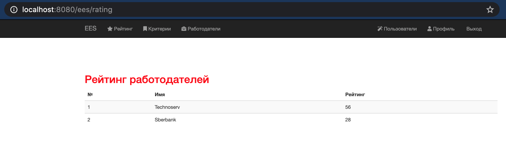

# Система оценки работодателей

## Основное приложение

Данный микросервис предоставляет возможность работать с системой внешним пользователям, 
а также осуществляет маршрутизацию и балансировку нагрузки работы микросервисов.  

### Работа с микросервисом

Основное приложение доступно доступны по адресу: [http://localhost:8080](http://localhost:8080)

Параметры работы микросервиса можно узнать по линкам здесь: [http://localhost:8080/actuator](http://localhost:8080/actuator)
